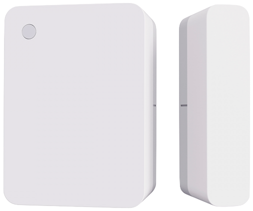

# Xiaomi Mi Smart Home Door/Window Sensor 2 (MCCGQ02HL)



> You could automatically get bindkey from Xiaomi Cloud by configuring `xiaomi_account` property in [MIOT](../miot/) platform.

Sample configuration:

```yaml
external_components:
  - source: github://dentra/esphome-components

binary_sensor:
  - platform: miot_mccgq02hl
    # String (Required), device MAC-address.
    mac_address: "device-mac-address"
    # String, (Optional), device bind key. Will use "xiaomi_account" from "miot" if absent to automatically get the bindkey.
    bindkey:
      "device-bind-key"
      # String, (Optional), the name of binary sensor
    name: "$name Door/Window Sensor"
    # BinarySensor (Optional), Light intensity: on - strong light, off - weak light
    light:
      name: "$name Light"
    # BinarySensor (Optional), Alert enabled when door/window has opened for a long (device configured) time
    alert:
      name: "$name Alert"
    # Sensor (Optional), r Level, %
    battery_level:
      name: "$name Battery Level"
    # Sensor (Optional), Battery Voltage, V
    battery_voltage:
      name: "$name Battery Voltage"
```

Now signal strength of a BLE device (RSSI) is not a part of this component, but you could easily add it:

```yaml
sensor:
  - platform: ble_rssi
    mac_address: "device-mac-address"
    name: "$name RSSI"
```
