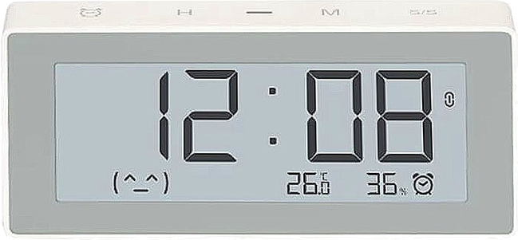

# Xiaomi Miaomiaoce Smart Clock Temperature Fnd Humidity Meter E-Inc (MHO-C303)

> This component is deprecated now. Pleased use [Universal Xiaomi Thermometer Hygrometer](../miot_thermogigro/) component instead.



> You colud automaticaly get bindkey from Xiaomi Cloud by configuring `xiaomi_account` property in [MIOT](../miot/) platform.

Sample configuration:
```yaml
external_components:
  - source: github://dentra/esphome-components

sensor:
  - platform: miot_mhoc303
    # String (Required), device MAC-address.
    mac_address: "device-mac-address"
    # String, (Optional), device bind key. Will use "xiaomi_account" from "miot" if absent to automaticaly get the bindkey.
    bindkey: "device-bin-key"
    # String, (Optional), the name of sensor
    name: "$name Temperature"
    # Sensor (Optional), Humidity, %
    humidity:
      name: "$name Humidity"
    # Sensor (Optional), Battey Level, %
    battery_level:
      name: "$name Battery Level"
    # Sensor (Optional), Battey Voltage, V
    battery_voltage:
      name: "$name Battery Voltage"
```

Now signal strength of a BLE device (RSSI) is not a part of this component, but you could easily add it:
```yaml
sensor:
  - platform: ble_rssi
    mac_address: "device-mac-address"
    name: "$name RSSI"
```

thanks to @Ujimych
