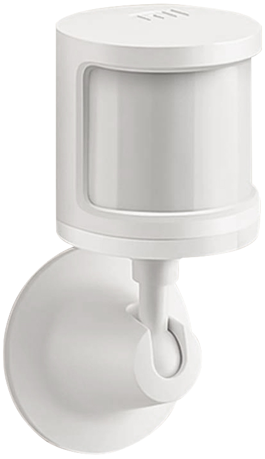

# Xiaomi Mi Smart Home Occupancy Sensor 2 (RTCGQ02LM)

> [!WARNING]
>
> This component is deprecated now. Please use [miot_motion](../miot_motion/) instead.



> You could automatically get bindkey from Xiaomi Cloud by configuring `xiaomi_account` property in [MIOT](../miot/) platform.

Sample configuration:

```yaml
external_components:
  - source: github://dentra/esphome-components

binary_sensor:
  - platform: miot_rtcgq02lm
    # String (Required), device MAC-address.
    mac_address: !secret device_mac_address
    # String, (Optional), device bind key. Will use "xiaomi_account" from "miot" if absent to automatically get the bindkey.
    bindkey: !secret device_bind_key
    # String, (Optional), the name of binary sensor. Reports no motion on first non 0 of idle_time or timeout.
    name: Motion
    # BinarySensor (Optional), device configured timeout.
    #   In opposite to the main sensor which can report their state immediately the `timeout` fires only when no motion
    #   is detected as configured timeout in Mi Home app.
    timeout:
      name: Timeout
    # Sensor (Optional), Time in seconds of inactivity.
    #   Additionally fires 2 times when no motion detected for a long time. It will report 0 at start motion, 120 when
    #   mo motion is 3 min ago and 300 when mo motion is 5 min ago.
    idle_time:
      name: Idle Time
    # BinarySensor (Optional), Light intensity: on - strong light, off - weak light.
    light:
      name: Light
    # Sensor (Optional), Battery Level, %.
    battery_level:
      name: Battery Level
    # Sensor (Optional), Battery Voltage, V.
    battery_voltage:
      name: Battery Voltage
```

Now signal strength of a BLE device (RSSI) is not a part of this component, but you could easily add it:

```yaml
sensor:
  - platform: ble_rssi
    mac_address: !secret device_mac_address
    name: RSSI
```
