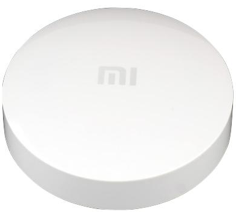

# Xiaomi Flood Sensor (SJWS01LM)



> You could automatically get bindkey from Xiaomi Cloud by configuring `xiaomi_account` property in [MIOT](../miot/) platform.

Sample configuration:

```yaml
external_components:
  - source: github://dentra/esphome-components

binary_sensor:
  - platform: miot_sjws01lm
    # String (Required), device MAC-address.
    mac_address: !secret device_mac_address
    # String, (Optional), device bind key. Will use "xiaomi_account" from "miot" if absent to automatically get the bindkey.
    bindkey: !secret device_bind_key
    # String, (Optional), the name of binary sensor
    name: Water Leak
    # Sensor (Optional), Battery Level, %
    battery_level:
      name: Battery Level
    # Sensor (Optional), Battery Voltage, V
    battery_voltage:
      name: Battery Voltage
```

Now signal strength of a BLE device (RSSI) is not a part of this component, but you could easily add it:

```yaml
sensor:
  - platform: ble_rssi
    mac_address: !secret device_mac_address
    name: RSSI
```
