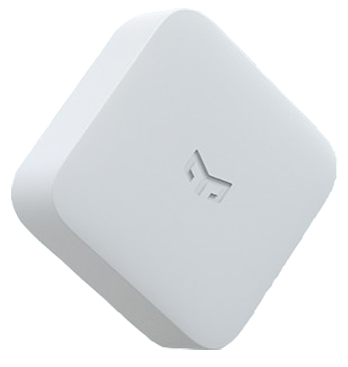

# Yeelight Remote Control 1S (YLAI003)



> You could automatically get bindkey from Xiaomi Cloud by configuring `xiaomi_account` property in [MIOT](../miot/) platform.

Sample configuration:

```yaml
external_components:
  - source: github://dentra/esphome-components

sensor:
  - platform: miot_ylai003
    # String (Required), device MAC-address.
    mac_address: "device-mac-address"
    # String, (Optional), device bind key. Will use "xiaomi_account" from "miot" if absent to automatically get the bindkey.
    bindkey: "device-bind-key"
    # Sensor (Optional), Battery Level, % (not 100% sure that is working, please let me know it so)
    battery_level:
      name: "$name Battery Level"
    # Sensor (Optional), Battery Voltage, V (not 100% sure that is working, please let me know it so)
    battery_voltage:
      name: "$name Battery Voltage"
    # List, Automation (Optional), The automation activated when you click the button
    on_click:
      then:
        - logger.log: button was clicked
    # List, Automation (Optional), The automation activated when you double click the button
    on_double_click:
      then:
        - logger.log: button was double clicked
    # List, Automation (Optional), The automation activated when you long press the button
    on_long_press:
      then:
        - logger.log: button was long pressed
```
